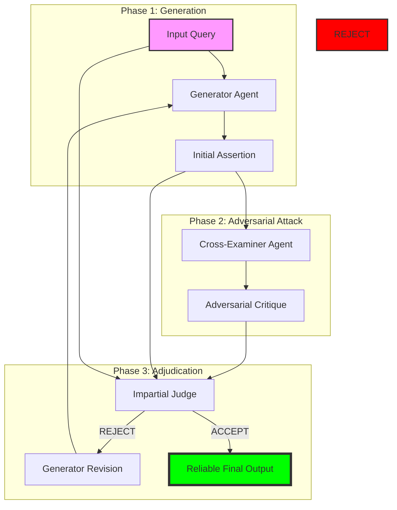
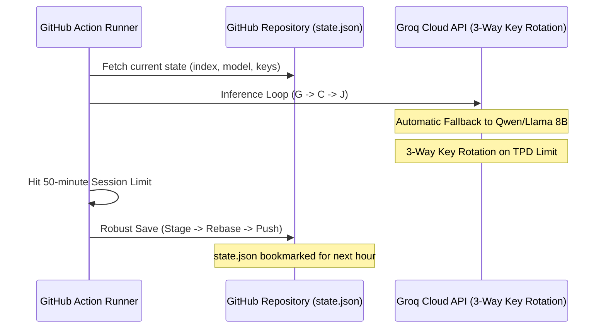

# X-Exam: Adversarial Reasoning for Factual Reliability in LLMs

## 📌 Project Vision
**X-Exam** is an autonomous research operation designed to challenge the status quo of Large Language Model (LLM) verification. Traditional "self-correction" methods (like Self-Refine or Reflexion) often suffer from **confirmation bias**, where a model simply agrees with its own hallucinations.

X-Exam fundamentally reconceptualizes verification as a **formal adversarial game**. By partitioning reasoning into three distinct, competing personas, we enforce a "Trial by Fire" for every clinical and logical assertion.

---

## 🧩 Architectural Deep Dive
The framework operates as a **tripartite minimax game**, moving beyond simple heuristic prompting toward a robust multi-agent verification system.

### 1. The Adversarial Trinity
| Persona | Objective | Instruction Strategy |
| :--- | :--- | :--- |
| **Generator (G)** | Maximize Accuracy | Acts as an expert solver, providing a step-by-step solution within `<assertion>` tags. |
| **Cross-Examiner (C)** | Minimize G's Reliability | Acts as a ruthless adversary. Its sole function is to assume G is wrong and expose logical fallacies or factual gaps. |
| **Judge (J)** | Impartial Adjudication | Presides over the dispute. It reviews the query, G's assertion, and C's critique to issue a `<verdict>ACCEPT</verdict>` or `<verdict>REJECT</verdict>`. |

### 🔄 Multi-Agent Workflow

---

## 🚀 Research Execution Protocol
This project is 100% autonomous, executed by an AI agent over a distributed Machine Learning Operations (MLOps) pipeline.

### 🧪 Scientific Rigor & Sampling
To ensure results are statistically significant and free from ordering bias, we implement a **Deterministic Random Sampling** strategy:
- **Seed 42:** We use a fixed random seed to ensure reproducibility.
- **Cap:** Large datasets (like HaluEval) are capped at **2,000 items** to optimize for benchmark diversity.
- **Full Coverage:** Smaller datasets (like TruthfulQA) are processed in their entirety.

### 📊 Evaluation Benchmarks
We focus on high-stakes domains where hallucinations are most dangerous:
- **Clinical/Medical:** MedQA (USMLE), MedMCQA.
- **Reasoning/Logic:** TruthfulQA, HaluEval, GSM8K.

---

## 🛠️ Autonomous MLOps Stack
The "Brain" of this research is a resilient Python controller orchestrated by GitHub Actions.

### 🏗️ Persistence & Resilience

### 🛡️ Smart Features:
1. **3-Way API Key Rotation:** Automatically cycles through `GROQ_API_KEY`, `GROQ_API_KEY_AYUSHI`, and `GROQ_API_KEY_AKAAKA` to maximize daily throughput.
2. **Model Fallback Chain:** Seamlessly drops from **Llama 3.3 70B** to **Qwen 3 32B** or **Llama 3.1 8B** when daily token limits are hit.
3. **Smart Sleep:** If all models/keys are exhausted, the runner enters a **4-hour cooldown** to save GitHub Actions minutes.
4. **Robust Save:** An aggressive retry-and-rebase Git loop that ensures data is never lost due to race conditions.

---

## 📜 Roadmap & Current Status
- [x] **Phase 1:** Repository Scaffolding & MLOps setup.
- [x] **Phase 2:** Dataset ingestion & deterministic sampling implementation.
- [x] **Phase 3:** Large-scale inference (Currently Processing `truthful_qa`).
- [ ] **Phase 4:** Statistical analysis (ECE Calculation, Brier Scores).
- [ ] **Phase 5:** LaTeX Manuscript Synthesis for NeurIPS.

---
*This entire research workspace is managed autonomously by Gemini CLI. No human intervention is permitted in the inference or analysis loops.*
