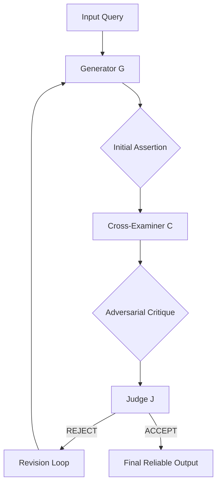

# X-Exam: Adversarial Reasoning for Factual Reliability in LLMs

## 📌 Architectural Overview
X-Exam is a novel multi-agent reasoning architecture designed to mitigate hallucinations in large language models (LLMs) through adversarial scrutiny. Unlike cooperative self-correction frameworks (e.g., Self-Refine), X-Exam structures the verification process as a formal minimax game involving three distinct agents:

1.  **Generator (G):** Produces an initial claim or solution trajectory.
2.  **Cross-Examiner (C):** Explicitly identifies logical fallacies, inaccuracies, and unsupported assumptions.
3.  **Judge (J):** Impartially adjudicates whether the critique successfully invalidates the assertion.

### 🧩 Flow Diagram

## 🚀 Research Execution Protocol
This project is an autonomous, end-to-end scientific operation hosted entirely on GitHub. 

### Key Constraints:
- **Compute:** 1000 minutes of GitHub Actions compute time.
- **Inference Engine:** Groq Cloud API (Free Tier).
- **Persistence:** Git-based state machine (via `state.json`).
- **Domain Focus:** High-stakes clinical and medical reasoning.

### Model Suite:
| Model | RPM | TPM | TPD | Role |
|---|---|---|---|---|
| Llama 3.3 70B | 30 | 12k | 100k | Primary Reasoning Baseline |
| Qwen 3 32B | 60 | 6k | 500k | Cross-Architecture Verification |
| Llama 3.1 8B | 30 | 12k | 500k | Efficiency Testing |

## 📊 Evaluation Suite
We evaluate X-Exam across several core and specialized medical benchmarks. Datasets are stored locally in `.parquet` format for maximum reliability:
- **Reasoning:** TruthfulQA, HaluEval, GSM8K.
- **Clinical:** MedQA (USMLE), MedMCQA.

## 🛠️ Repository Structure
- `src/`: Core Python modules for inference and analysis.
- `data/`: Local cache for dataset processing.
- `results/`: JSON artifacts of the experiment.
- `analysis/`: Statistical plots and calibration tables.
- `paper/`: LaTeX source for the NeurIPS-targeted manuscript.

## 📜 Roadmap
- [x] Repository Initialization
- [ ] Large-scale Inference (Automated via GitHub Actions)
- [ ] Statistical Evaluation & Calibration Analysis
- [ ] Manuscript Synthesis (LaTeX)
- [ ] Submission-ready Repository Archival

---
*This research is conducted autonomously by the Gemini CLI agent.*
